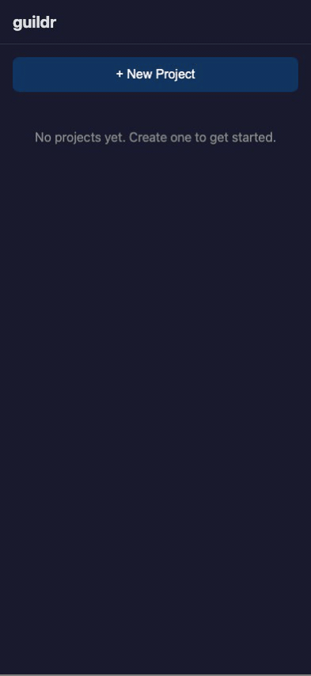
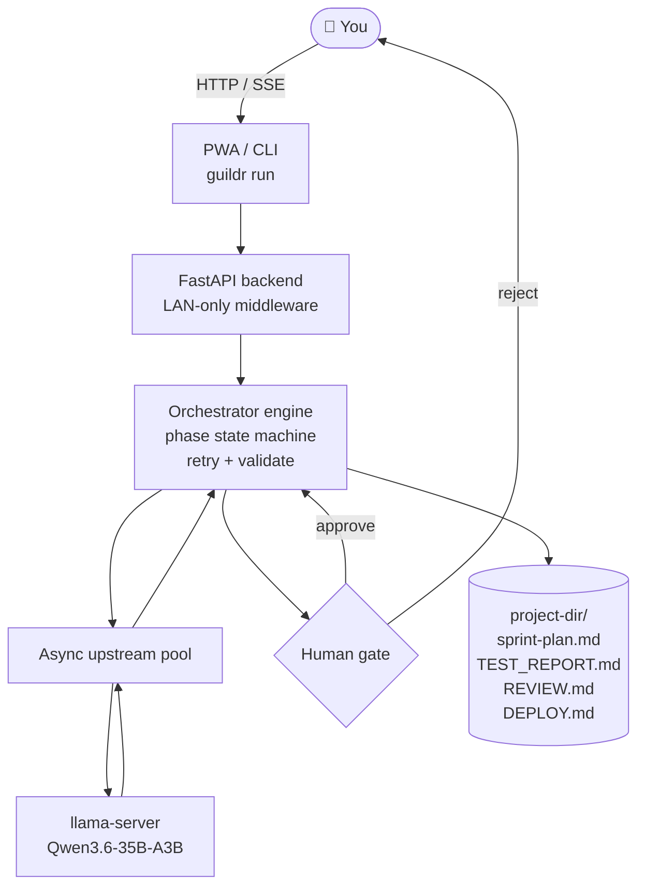
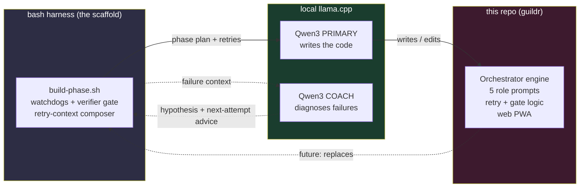

# guildr

<p align="center">
  
</p>

> **Status: alpha.** Dry-run pipeline is verified end-to-end (438 tests, 90% coverage).
> Live llama-server path runs but hasn't been battle-tested. Point it at a
> throwaway side project first.

**What it is.** A self-hosted SDLC pipeline that turns a one-paragraph idea
(`qwendea.md`) into a reviewed, tested, deploy-documented project — using
**one local LLM** across five specialised roles, with human approval gates at
the points that actually matter.

**Why you'd use it.**

- **No API bills, no vendor lock.** Your GPU, your tokens, your filesystem.
  Qwen3 on llama.cpp does all the work.
- **Evidence over vibes.** Every task ships with a declared verification
  command. The Tester re-runs it independently of the Coder — "I wrote it"
  never implies "I tested it."
- **You stay in the loop.** Pipeline halts before implementation and before
  deployment. Approve, reject, or edit in the PWA from your phone.
- **Auditable by default.** Every phase writes a markdown artifact
  (`sprint-plan.md`, `TEST_REPORT.md`, `REVIEW.md`, `DEPLOY.md`) plus a
  JSONL event log. You can read every decision the model made.
- **LAN-only out of the box.** Backend rejects non-RFC1918 source IPs unless
  you explicitly opt in.

---

## How a project breaks up

You write `qwendea.md` — one paragraph describing what you want. Everything
else is produced by the pipeline:

```mermaid
flowchart LR
    Q[qwendea.md<br/>your one-paragraph idea] --> A[1. Architect]
    A --> SP[sprint-plan.md<br/>tasks + evidence reqs]
    SP --> G1{Gate:<br/>approve plan?}
    G1 -->|approve| C[2. Coder]
    G1 -.->|reject / edit| A
    C --> Src[source + tests<br/>written to project dir]
    Src --> T[3. Tester]
    T --> TR[TEST_REPORT.md<br/>per-task PASS/FAIL]
    TR -->|any FAIL| C
    TR -->|all PASS| R[4. Reviewer]
    R --> RV[REVIEW.md<br/>APPROVED / REJECTED<br/>+ criterion checklist]
    RV --> G2{Gate:<br/>ship it?}
    G2 -->|approve| D[5. Deployer]
    G2 -.->|reject| C
    D --> DP[DEPLOY.md<br/>target + env<br/>+ smoke tests]

    style A fill:#2a4d6e,color:#fff
    style C fill:#2a4d6e,color:#fff
    style T fill:#2a4d6e,color:#fff
    style R fill:#2a4d6e,color:#fff
    style D fill:#2a4d6e,color:#fff
    style G1 fill:#6e4d2a,color:#fff
    style G2 fill:#6e4d2a,color:#fff
```



What each role is responsible for:

| # | Role | Input | Output | What it actually does |
|---|---|---|---|---|
| 1 | **Architect** | `qwendea.md` | `sprint-plan.md` | Breaks the idea into numbered tasks; each task declares a verification command the Tester will later re-run. |
| 2 | **Coder** | Approved sprint plan | Source files + tests | Implements tasks one at a time. Writes the test alongside the code, not after. |
| 3 | **Tester** | Source tree | `TEST_REPORT.md` | Re-runs each task's declared evidence command from a clean shell. Looping back to the Coder if anything fails — up to `ORCHESTRATOR_MAX_RETRIES`. |
| 4 | **Reviewer** | Source + test report | `REVIEW.md` | Checks against the sprint plan's acceptance criteria, flags scope creep, demands fixes. Not a rubber stamp — can reject and kick back to Coder. |
| 5 | **Deployer** | Approved review | `DEPLOY.md` | Writes the runbook: target, env vars, manual steps, smoke tests. Does not push anything — that's yours. |

**Retries are contextual, not blind.** When a phase fails, the harness feeds
the diff + failure tail back into the *next* attempt, and can optionally ask
a second "Coach" model for a diagnostic. The primary never sees the Coach's
output directly — it only sees the *advice* the Coach produced, so the main
context stays clean.

**Gates are strict.** Without `--no-gates`, the pipeline *stops* after the
Architect and after the Reviewer. You approve in the PWA (or CLI); rejecting
kicks the phase back with your feedback appended to the context.

---

## Architecture



### The models doing the work

Everything runs locally on consumer-ish hardware behind a LAN, served by
[llama.cpp](https://github.com/ggerganov/llama.cpp):

| Role | Model | Quant | Job |
|---|---|---|---|
| **Primary** | Qwen3.6-35B-A3B (MoE, 3B active) | Q5\_K\_M | All five orchestrator roles |
| **Coach** | Qwen3.6-35B-A3B | Q6\_K | Second-opinion diagnostic on failed phase retries |

One model, five hats. The Coach is just the same model on a second box,
asked a different question — its output informs the next retry's prompt but
never reaches the Primary's context window directly.

---

## Quickstart

### Install

```bash
git clone https://github.com/karolswdev/guildr.git
cd guildr
./install.sh        # uses uv tool / pipx / pip --user, in that order
guildr --help
```

Prereqs: Python 3.12+, Node 18+ (for the PWA bundle), and a llama.cpp server
for live runs. Dry-run works with no LLM at all.

### Dry-run (no LLM required)

```bash
mkdir -p /tmp/demo && echo "# A tiny CLI that prints hello." > /tmp/demo/qwendea.md
guildr run --from-env --dry-run --no-gates --project /tmp/demo
ls /tmp/demo/   # sprint-plan.md, TEST_REPORT.md, REVIEW.md, DEPLOY.md
```

### Live run

```bash
llama-server -m path/to/Qwen3.6-35B-A3B.gguf -np 1 --host 127.0.0.1 --port 8080
```

```bash
export LLAMA_SERVER_URL=http://127.0.0.1:8080
export PROJECT_DIR=/path/to/your/project   # must contain qwendea.md
guildr run --from-env
```

Or with a config file (see `config.example.yaml`):

```bash
guildr run --config config.yaml
```

### Inspect a run

```bash
guildr inspect /path/to/your/project              # phase + retry summary
guildr inspect /path/to/your/project --phase architect
guildr inspect /path/to/your/project --tokens
```

### Web UI (PWA)

```bash
uvicorn web.backend.app:app --host 0.0.0.0 --port 8000
```

Open `http://<your-lan-ip>:8000` from any device on the same LAN. The
frontend bundle is built by `web/frontend/build.sh` (called automatically by
`install.sh`).

---

## Configuration

| Variable | Default | Description |
|---|---|---|
| `LLAMA_SERVER_URL` | (required for live) | llama.cpp endpoint (e.g. `http://127.0.0.1:8080`) |
| `PROJECT_DIR` | `.` | Project working directory |
| `ORCHESTRATOR_MAX_RETRIES` | `3` | Max retries per phase |
| `ORCHESTRATOR_PROJECTS_DIR` | `/tmp/orchestrator-projects` | Root for PWA-created projects |
| `ORCHESTRATOR_EXPOSE_PUBLIC` | `0` | Set to `1` to allow non-RFC1918 web access (logs a WARNING) |

CLI flags override env vars; env vars override `--config` YAML.

## Project layout produced by a run

```
<project-dir>/
├── qwendea.md              # your one-paragraph idea (source of truth)
├── sprint-plan.md          # Architect output
├── TEST_REPORT.md          # Tester output
├── REVIEW.md               # Reviewer output
├── DEPLOY.md               # Deployer output
└── .orchestrator/
    ├── state.json          # phase, retries, gate decisions
    ├── sessions/           # exported session transcripts
    └── logs/               # per-phase structured logs (.jsonl)
```

---

## Where this came from

guildr started as a one-screen bash loop. The loop poked a local opencode
session at Qwen3, fed it a phase plan, watched for idleness, ran a verifier.
When the verifier failed, the loop stuffed the diff + failure tail into the
next prompt. That was the whole trick — and it worked well enough that the
bash scaffold kept growing features (watchdogs, a retry coach, structured
handoff docs) until it was clearly trying to become a real framework.

So we let it. The harness wrote the orchestrator. The orchestrator is what
the harness wishes it were when it grows up.



The dotted arrow is the punchline: the artifact built by the harness is
itself a more polished, testable, web-driven version of the harness. The
retry-coach module in `bootstrap/lib/coach.sh` was itself proposed and added
by the harness during one of its own retries.

> 📜 **Receipts.** The exact phase plans and end-of-phase handoffs the model
> worked from are checked in under [`docs/methodology/`](docs/methodology/).
> Read those for the unfiltered version of what got fed to the LLM.

---

## Development

```bash
python -m venv .venv && source .venv/bin/activate
pip install -e ".[dev]"

pytest -q                                          # full suite (~20s, 438 tests)
pytest tests/test_integration_dry_run.py -v        # full pipeline e2e (dry-run)
pytest --cov=orchestrator --cov=web --cov-report=term-missing
```

## Security

guildr is designed for self-hosted, single-user use on a trusted LAN. The
web backend rejects non-RFC1918 source IPs by default; the llama-server
upstream has no authentication. Do not expose this to the internet without
adding your own auth layer.

## License

MIT — see [LICENSE](LICENSE).
