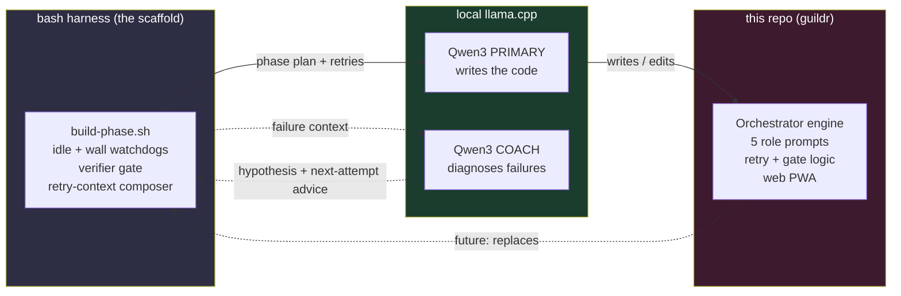
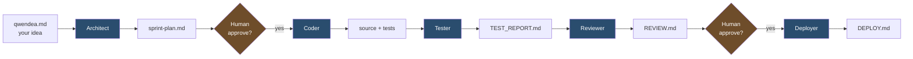

# guildr

> **Status: alpha.** The dry-run pipeline is verified end-to-end (438 tests, 90% coverage).
> The live llama-server path runs but hasn't been battle-tested on real projects.
> Use it on a throwaway side project before trusting it with anything important.

A single-model SDLC orchestrator. You write a one-paragraph project idea;
guildr drives it through Architect → Coder → Tester → Reviewer → Deployer
roles, all backed by **one** local LLM (Qwen3 via llama.cpp), pausing at
human-approval gates between phases.

---

## Where this came from

guildr started as a one-screen bash loop. The loop poked an opencode CLI
session at a locally-hosted Qwen3 model, fed it a phase plan, watched for
idleness, and ran a verifier. When the verifier failed, the loop stuffed the
diff and the failure tail back into the next prompt. That was the whole
trick. It worked surprisingly well — well enough that the loop kept growing
features (idle/wall watchdogs, a retry coach that asks a *second* model to
diagnose failures, structured handoff docs between phases), and at some
point the bash scaffold was clearly trying to become a real framework.

So we let it. The harness wrote the orchestrator. The orchestrator is what
the harness wishes it were when it grows up. This repo is the result.

### The models doing the work

Everything runs locally on consumer-ish hardware behind a LAN, served by
[llama.cpp](https://github.com/ggerganov/llama.cpp):

| Role | Model | Quant | Job |
|---|---|---|---|
| **Primary** | Qwen3.6-35B-A3B (MoE, 3B active) | Q5\_K\_M | All five orchestrator roles — architect, coder, tester, reviewer, deployer |
| **Coach** | Qwen3.6-35B-A3B | Q6\_K | Second-opinion diagnostic on failed phase retries |

One model, five hats. The coach is just the same model on a second box,
asked a different question (*"why did this verifier fail and what should the
next attempt try differently?"*) so its answer doesn't pollute the primary's
context window.

### Dogfooding, visualized



The dotted arrow at the bottom is the punchline: the artifact built by the
harness is itself a more polished, testable, web-driven version of the
harness. The retry-coach module that lives in `bootstrap/lib/coach.sh` was
itself proposed and added by the harness during one of its own retries.

> 📜 **Want the receipts?** The actual phase plans and end-of-phase handoffs
> the model worked from are checked in under
> [`docs/methodology/`](docs/methodology/). Read those if you want to see
> exactly what was fed to the LLM at each step, not the marketing version.

---

## Architecture




- **One model, many roles.** All five roles hit the same llama-server with
  role-specific system prompts. No vendor lock, no API keys, no per-token
  metering — your hardware, your tokens.
- **Evidence-driven.** Every task in the sprint plan declares verifiable
  evidence; the Tester re-runs that evidence independently of the Coder's
  claims, so "I wrote it" never means "I tested it."
- **Human gates.** Pipeline halts before implementation and before
  deployment until you approve through the PWA (or pass `--no-gates`).
- **LAN-only by default.** Web backend rejects non-RFC1918 source IPs unless
  you explicitly opt in with `ORCHESTRATOR_EXPOSE_PUBLIC=1`.
- **Dry-run mode.** Drive the full pipeline with a fake LLM to validate
  wiring without burning tokens.

## Install

```bash
git clone https://github.com/karolswdev/guildr.git
cd guildr
./install.sh        # uses uv tool / pipx / pip --user, in that order
```

This installs the `guildr` binary on your `PATH`. Verify:

```bash
guildr --help
```

### Prerequisites

- Python 3.12+
- (Optional, for live runs) A llama.cpp server. Tested with Qwen3.6-35B-A3B
  at 131K context, `-np 1`. See [llama.cpp](https://github.com/ggerganov/llama.cpp).
- (Optional, for the PWA) Node 18+ — the install script bundles the frontend
  via `npx esbuild`.

## Quickstart

### Dry-run (no LLM required)

```bash
mkdir -p /tmp/demo && echo "# A tiny CLI that prints hello." > /tmp/demo/qwendea.md
guildr run --from-env --dry-run --no-gates --project /tmp/demo
ls /tmp/demo/   # sprint-plan.md, TEST_REPORT.md, REVIEW.md, DEPLOY.md
```

### Live run

Start a llama.cpp server, then point guildr at it:

```bash
llama-server -m path/to/Qwen3.6-35B-A3B.gguf -np 1 --host 127.0.0.1 --port 8080
```

```bash
export LLAMA_SERVER_URL=http://127.0.0.1:8080
export PROJECT_DIR=/path/to/your/project   # must contain qwendea.md
guildr run --from-env
```

Or with a config file (see `config.example.yaml`):

```bash
guildr run --config config.yaml
```

### Inspect a run

```bash
guildr inspect /path/to/your/project              # phase + retry summary
guildr inspect /path/to/your/project --phase architect
guildr inspect /path/to/your/project --tokens
```

## Configuration

| Variable | Default | Description |
|---|---|---|
| `LLAMA_SERVER_URL` | (required) | llama.cpp endpoint (e.g. `http://127.0.0.1:8080`) |
| `PROJECT_DIR` | `.` | Project working directory |
| `ORCHESTRATOR_MAX_RETRIES` | `3` | Max retries per phase |
| `ORCHESTRATOR_EXPOSE_PUBLIC` | `0` | Set to `1` to allow non-RFC1918 web access (logs a WARNING) |

CLI flags override env vars; env vars override `--config` YAML.

## Project layout produced by a run

```
<project-dir>/
├── qwendea.md              # Source of truth — what we're building (you write this)
├── sprint-plan.md          # Architect: tasks + evidence requirements
├── TEST_REPORT.md          # Tester: per-task PASS/FAIL with evidence
├── REVIEW.md               # Reviewer: APPROVED / REJECTED + criterion checklist
├── DEPLOY.md               # Deployer: target, env, manual steps, smoke tests
└── .orchestrator/
    ├── state.json          # Phase, retries, gate decisions
    ├── sessions/           # Exported session transcripts
    └── logs/               # Structured logs per phase (.jsonl)
```

## Web UI (PWA)

```bash
uvicorn web.backend.app:app --host 0.0.0.0 --port 8000
```

Then open `http://<your-lan-ip>:8000` from any device on the same LAN.
The frontend bundle is built by `web/frontend/build.sh` (called automatically
by `install.sh`).

## Development

```bash
python -m venv .venv && source .venv/bin/activate
pip install -e ".[dev]"

pytest -q                                          # full suite (~20s, 438 tests)
pytest tests/test_integration_dry_run.py -v        # full pipeline e2e (dry-run)
pytest --cov=orchestrator --cov=web --cov-report=term-missing
```

## Security

guildr is designed for self-hosted single-user use on a trusted LAN. The web
backend rejects non-RFC1918 source IPs by default; the llama-server upstream
has no authentication. Do not expose this to the internet without adding
your own auth layer.

## License

MIT — see [LICENSE](LICENSE).
