# Guildr — Pitch Deck

> A LAN-only PWA that lets one operator hand a project to a Qwen-powered SDLC pipeline and *review, follow, and intervene* as it runs — where the touch surface feels like an incredible game, not a spreadsheet dashboard.

**Status:** post-H6 (opencode-per-role) · 518 tests green · dry-run path proven · live-path battle test pending (Harness 2).

This deck is honest about what exists today and optimistic about what the bones can become. Sections marked **Today** describe code that runs right now; sections marked **Trajectory** describe the short roadmap; sections marked **Aspirational** describe vision commitments that are not yet uniformly delivered and are tracked in `analysis/04-22-2026-FEEDBACK.md`.

---

## 1. The one-liner

> *"I pointed my iPhone at my laptop, wrote three sentences of what I wanted, and watched six LLM personas build, test, review, and ship it — on my couch, on my LAN, with no OpenAI bill."*

That is the product experience. Everything below serves it.

---

## 2. The problem

Two problems compound.

**Problem A — agent frameworks feel like terminals.**
The serious orchestration tools (LangGraph, AutoGen, CrewAI, opencode-core, Claude Code) all surface as logs, tool-call JSON, or a REPL. Powerful, but they treat the human as a log reader. You *watch* your agents; you do not *play* with them. The feedback loop is cognitively expensive and emotionally flat.

**Problem B — cloud-first is a poor fit for local-first hardware.**
A modern Mac with a Qwen3.6-35B-A3B model running under llama-server is a serious inference engine. It fits on a desk. It does not leave the house. It has no per-token bill. But the tooling that would let a curious operator *use* that hardware like a game console — hand it a project, watch it think, nudge it when it drifts — does not yet exist in a polished form.

Guildr attacks both at once: a local-first SDLC pipeline with a touch-first, game-grade UI.

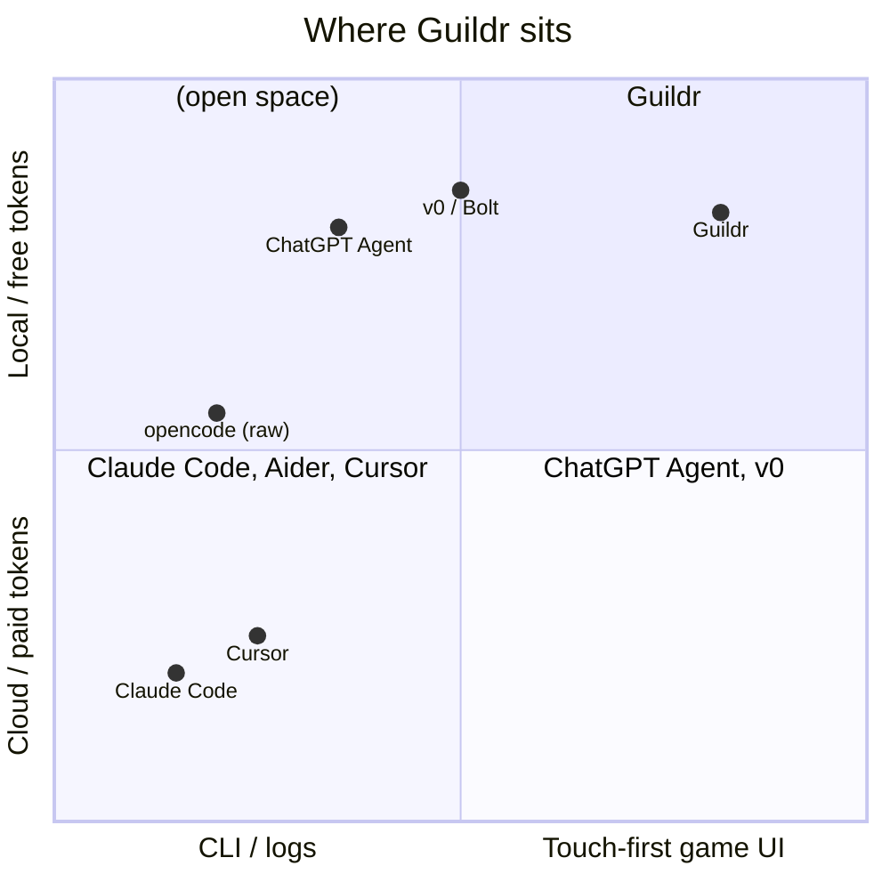

---

## 3. The vision, stated plainly

Guildr is built around ten load-bearing commitments. The full set lives in `analysis/04-22-2026-FEEDBACK.md` §0.1 — the five that define the product identity are:

1. **Qwen-first, local-first.** PRIMARY (192.168.1.13) + ALIEN (192.168.1.70) llama-server endpoints. 128 KiB context ceiling is a hard wall.
2. **Idle-RPG, not watchdog.** The operator can be at dinner. Gates are opt-in, not the norm.
3. **Three pillars, each must be real.** Follow · Review · Intervene. Cosmetic versions of any of these are a failure.
4. **Memory palace is a first-class citizen.** Every claim a role makes should trace back to the project's long-term brain.
5. **Gamification IS the interface.** Not a skin. Action ring, object lens, narrator dialogue, timeline ribbon, compose dock, map — these *are* the UI.

---

## 4. What is already true today

These are not promises. They are the current, tested state of the repo.

| Capability | Status | Evidence |
|---|---|---|
| End-to-end SDLC dry run (Architect → Coder → Tester → Reviewer → Deployer → Judge) | ✅ Green | `tests/test_integration_dry_run.py`, 518 tests |
| Per-role opencode subprocess (H6 migration done) | ✅ Shipped | `orchestrator/cli/run.py::_build_opencode_session_runners` |
| Event ledger as single source of truth (SSE → frontend fold) | ✅ Shipped | `EventBus` → `BridgingEventBus` → `SimpleEventBus`; `EventEngine::applyFold` |
| Operator intents — queued → applied/ignored terminal | ✅ Shipped (M02B) | `web/backend/routes/intents.py` |
| Narrator sidecar with pre-step / refined / fallback modes | ✅ Shipped | `orchestrator/lib/narrator_sidecar.py` |
| Next-step packet projection with memory provenance | ✅ Shipped (M08) | `orchestrator/lib/next_step.py` |
| Founding-team seeding at project start | ✅ Shipped | `orchestrator/roles/persona_forum.py` |
| Memory palace provenance on usage rows + next-step packet | ✅ Shipped | `opencode_audit._emit_usage`, `build_next_step_packet` |
| LAN-only PWA (iPhone over WiFi → laptop) | ✅ Shipped | `web/backend/app.py` + `web/frontend/` |
| Audit trail (`raw-io.jsonl`, `usage.jsonl`, `events.jsonl`, artifacts) | ✅ Shipped | `orchestrator/lib/opencode_audit.py` |

**Test count trajectory:** 438 → 482 → 518 over the H6 → M02B → M08 waves. Dry-run coverage is the reason we can refactor aggressively.

---

## 5. How it works (architecture)

### 5.1 Physical topology

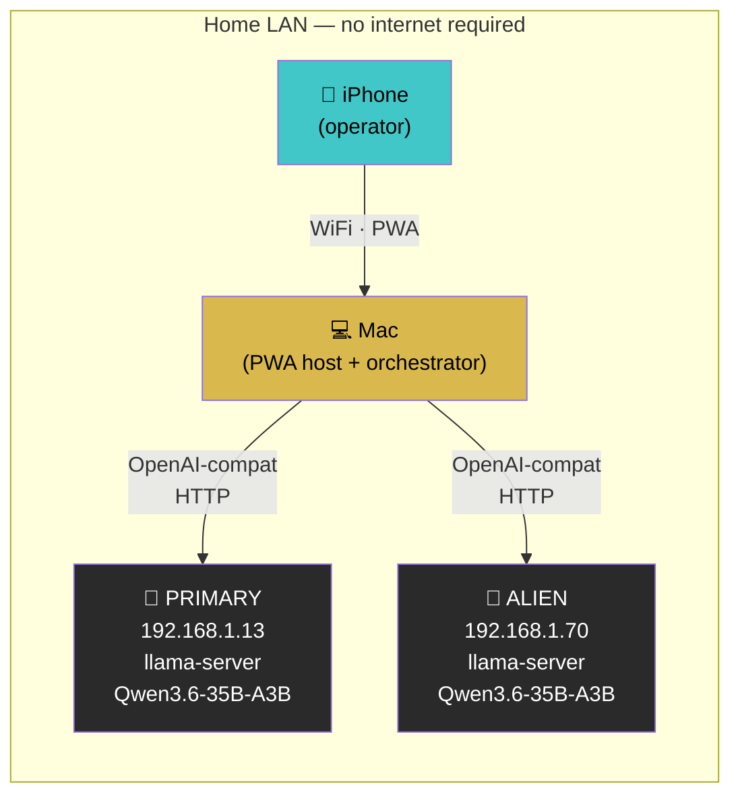

No internet. No cloud. No per-token bill. The operator's phone is the touch surface; the laptop is the brain host; the two llama-server boxes are the inference substrate.

### 5.2 Opencode per role

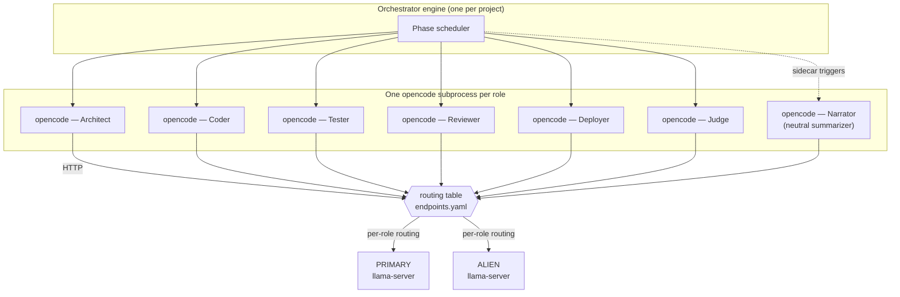

**Why this matters:** each role has its own session, its own context, its own audit trail. No shared pool, no context bleed. The routing table lets us send heavy roles (Coder) to PRIMARY and lighter roles (Reviewer, Judge) to ALIEN — role-appropriate models, per-endpoint isolation. This is the H6 win.

### 5.3 Event ledger as truth

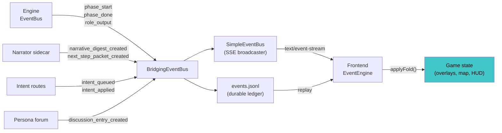

Every operator-visible action is an event. Replay = scrub through events. If a feature cannot be expressed as ledger events, it does not belong in Guildr.

---

## 6. The three pillars (what a real operator gets)

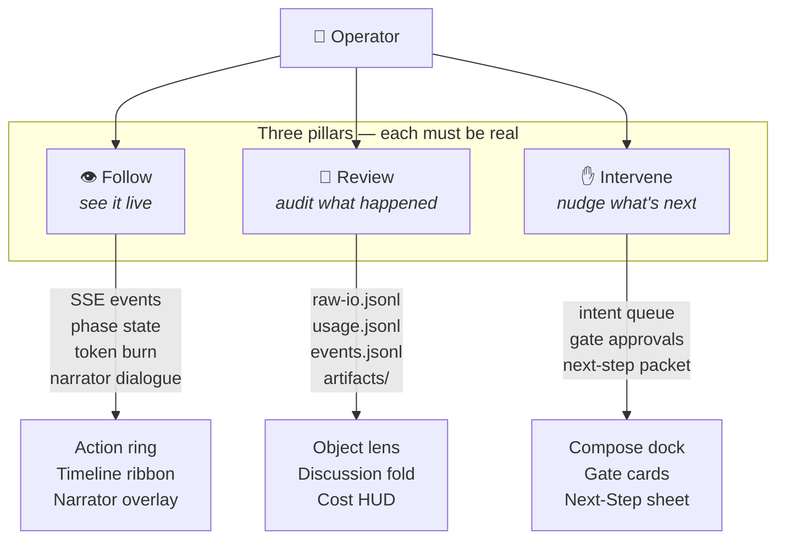

**"Intervene was cosmetic" was true pre-M02B.** It is not true anymore. `POST /api/projects/{id}/intents` lands on an intent that the next phase actually reads via the next-step packet projection. The terminal status (`applied` or `ignored`) is not theater — there is a test for it.

---

## 7. The operator journey

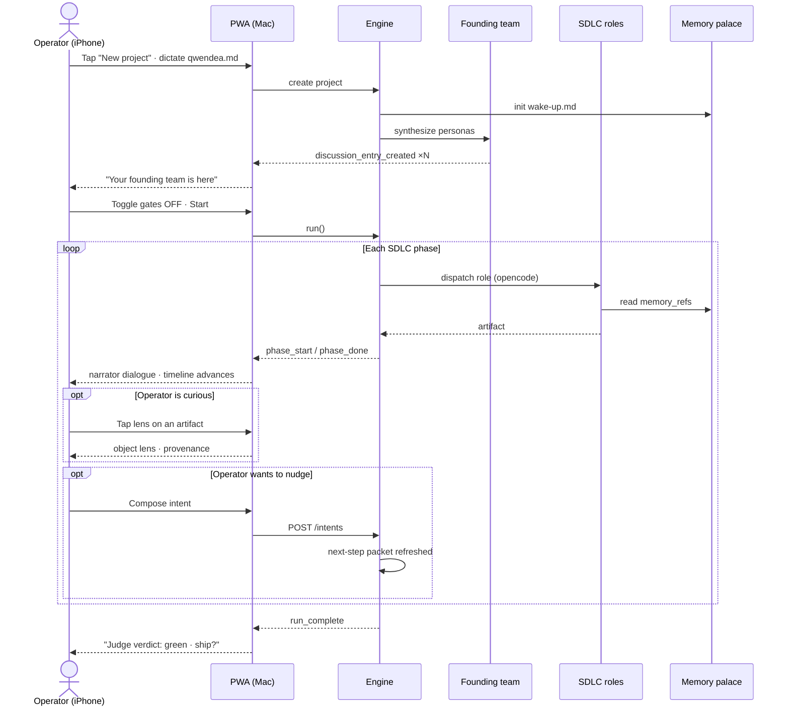

No blocking. No coercion. The operator *can* look at every detail. They don't *have* to.

---

## 8. Memory palace — the project's long-term brain

**Status:** partially delivered — tracked as A-9 in the audit.

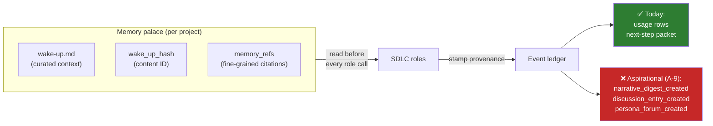

The palace is load-bearing for a review question a cloud agent cannot answer: *"why did this role think that?"* When every user-facing claim stamps `memory_refs`, the operator can tap a digest highlight and see the exact context snippet that shaped it. That is the Review pillar taken seriously.

---

## 9. Founding team — personas as recurring voices

**Status:** seeded-once today; recurring-voice behavior is aspirational — tracked as A-8.

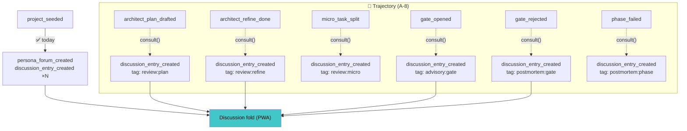

The personas are not set-and-forget NPCs. When we close A-8, they will be recurring voices — critiquing the plan, flagging gate openings, writing post-mortems on phase failures. The operator gets a reviewable record of who said what and when.

---

## 10. The PWA as a game surface

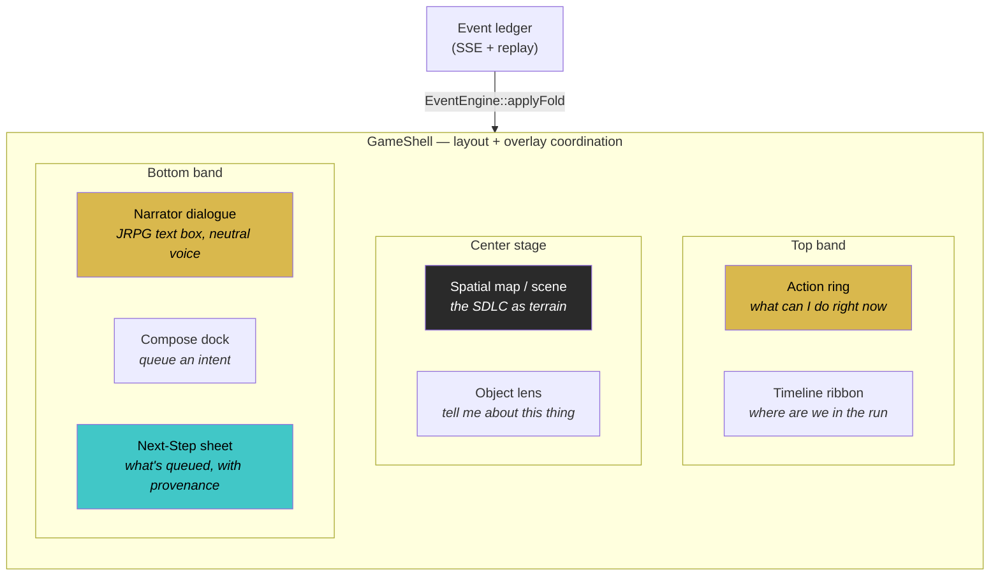

**What makes this a game surface and not a dashboard:**

- **Action ring, not menu bar.** The operator always knows *what they can do now*. Actions are large, tactile, iconographic.
- **Object lens, not modal dialog.** Tap anything on the map — a phase, an artifact, a persona — get its story. No nested settings screens.
- **Narrator dialogue, not log tail.** Typewriter cadence, neutral voice, JRPG aesthetic. Summary, not stream.
- **Compose dock, not "add comment."** Intent composition is a first-class motion, not a buried form.
- **Timeline ribbon, not progress bar.** You can scrub. You can replay. You can see the shape of the run.

**Status:** the vocabulary exists in `web/frontend/src/game/GameShell.ts` (1371 lines — an extraction is tracked as C-1). The polish bar is tracked as D-8.

---

## 11. The honest state of play

Because shipping pitch decks that lie is how projects lose trust, here is the current audit picture straight from `analysis/04-22-2026-FEEDBACK.md`:

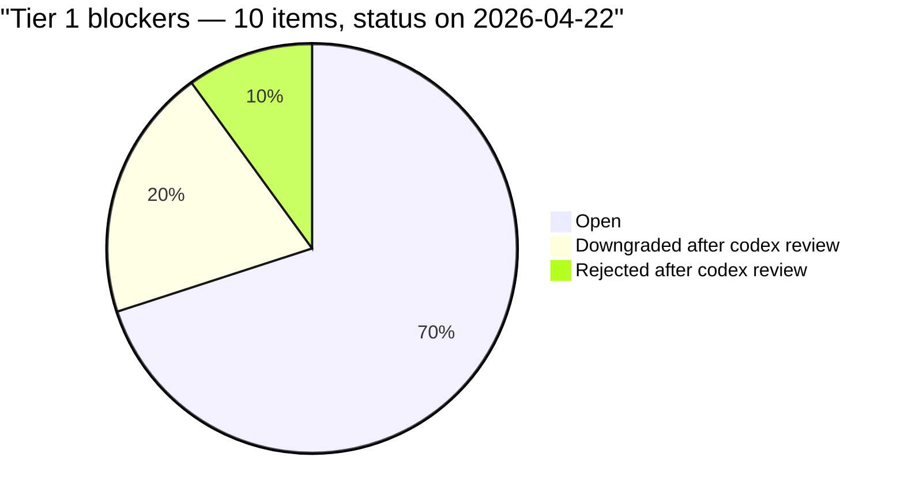

- **7 open Tier 1 items.** Mostly cohesion and concurrency — "three emitters one contract" (B-2), doc drift (B-9, B-10), HTTP reaching into persona forum privates (B-6), RunRegistry TOCTOU (B-7), sidecar read-modify-write (B-8), one dead method (B-3).
- **518 tests green.** Baseline is solid. The open blockers are hygiene and hardening, not "does the pipeline work."
- **Harness 2 (live-path battle test) is next.** Dry run is proven; live `llama-server` + gates-on run through the PWA has not been done end-to-end since the opencode migration. That is the next milestone.
- **Memory palace uniformity (A-9) and founding-team cadence (A-8) are the two vision gaps.** Both are scoped, both have trigger matrices, both are tractable.

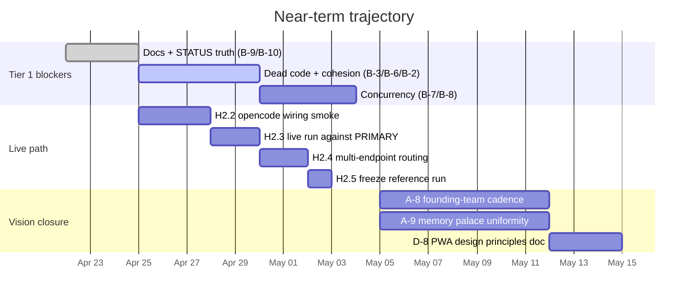

---

## 12. Where this goes — the M-series roadmap

The live plan is `project-management/srs-mini-phases/M01–M12`. In aggregate:

| Phase | Theme | Shorthand |
|---|---|---|
| M01 | Baseline hygiene | 500+ tests green, H6 landed |
| M02 / M02B | Intent lifecycle | Intervene pillar made real |
| M04 | Narrative digest | Replay with neutral narration |
| M05 | Discussion log | Founding-team forum seeded |
| M06 | PWA lenses + map | The game surface exists |
| M07 | Narrator sidecar | Pre-step + refined + fallback |
| M08 | Next-step packet | Memory-provenance-carrying intent refresh |
| M09 | *Harness 2 completion* | Live-path verified end-to-end |
| M10 | Cost + capacity signals | Honest per-endpoint token economics |
| M11 | Founding-team cadence | A-8 closed; personas as recurring voices |
| M12 | Gamification polish | D-8 closed; design language becomes a doc + tokens |

Every M-phase has a `done-means` block in its file. Every `done-means` is testable.

---

## 13. What's new here — the wedge

A fair question: why not just use opencode, or Cursor, or ChatGPT Agent, or build a thin wrapper over any of them?

| Alternative | What you lose |
|---|---|
| **opencode (raw)** | No operator surface. You are a log reader. No gates UI, no intent queue, no narrator, no map. |
| **Cursor / Aider / Claude Code** | Cloud-first. Per-token bill. No multi-role SDLC orchestration — it's one model at one keyboard. |
| **ChatGPT Agent / v0** | Cloud-bound. Your code leaves the house. You do not choose the model. |
| **LangGraph + Streamlit** | You can build it, but you'd build it. Months of boilerplate for an experience that still looks like a dashboard. |
| **Build from scratch** | That is what we're doing. The wedge is *touch-grade UI over local inference for full-SDLC orchestration* — nobody has shipped it. |

**The wedge in one sentence:** Guildr is the only tool where a curious operator can hand a project to a full SDLC of local Qwen personas and *play* with the run — not merely watch it — with audit, intervene, and replay all first-class and none of them cosmetic.

---

## 14. The ask

This deck exists so a fresh reader — a collaborator, an evaluator, a future-you with cleared context — can land in the repo and understand what is being built, what is real, what is aspirational, and where to start.

**If you are picking up work:** read `analysis/04-22-2026-FEEDBACK.md` §0 and follow the onboarding runbook there.

**If you are evaluating the vision:** §3 of this deck and §0.1 of the audit are the two vision surfaces. They agree by construction.

**If you want to see the bones run:** `.venv/bin/python -m pytest -q` — 518 tests, dry-run path, green. The most honest demo is the one that passes every time.

---

## 15. Closing

Guildr is not trying to replace cloud agents. It is trying to show that local inference + a serious touch-first surface is its own category — one that respects the operator's time, their network, their bill, and their curiosity. The code is further along than the docs suggested before this audit wave. The vision gaps are scoped, not hand-wavy. The next milestone is proving the live path end-to-end.

We are one Harness-2 run away from being able to say, honestly and without asterisks: *live path verified end-to-end via opencode, with gates on, from the PWA.*

That is the headline we are building toward.

---

*Document opened 2026-04-22. Edits land in `analysis/04-22-2026-FEEDBACK.md` §12 changelog.*
